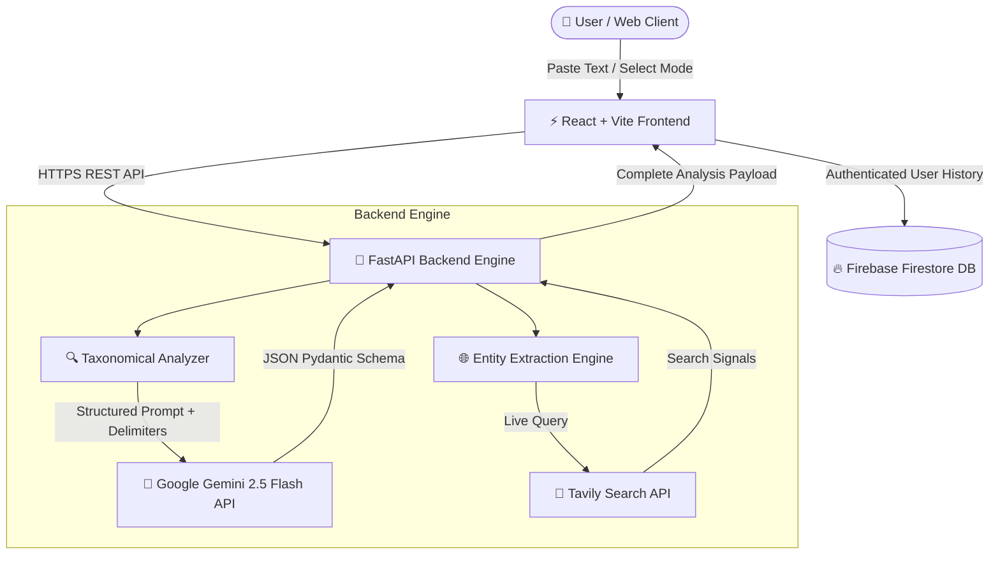

# ClarityGuard 🛡️ — See Through the Fine Print

> **"We built the someone who explains the fine print."**


[](https://clarity-guard.vercel.app)
[](https://ai.google.dev/)
[](https://fastapi.tiangolo.com)
[](https://react.dev)
[](https://firebase.google.com)

---

## 🚀 Problem Statement

Every day, millions of consumers, freelancers, and tenants sign contracts they cannot parse and receive suspicious messages designed to exploit legal & psychological confusion:
- **Asymmetric Power**: Corporate legal teams write 30-page agreements designed to shift 100% of liability onto you.
- **Predatory Scams**: Fraudulent SMS/email messages exploit artificial urgency and impersonation to bypass critical thinking.
- **Vague AI Summaries**: Standard AI assistants give high-level text summaries but fail to name the *exact* legal trick or offer actionable counter-measures.

---

## ⚡ The Solution: ClarityGuard

**ClarityGuard** is an AI-powered legal & scam X-ray engine. Paste any contract, lease, or suspicious message, and ClarityGuard instantly:
1. **Identifies Exact Manipulation Tricks** against an 18-tactic closed taxonomy.
2. **Verifies Real-World Entities** using live web search across business registries & fraud reporting databases.
3. **Compares Predatory Clauses** side-by-side with fair, balanced market standards.
4. **Auto-Drafts Defensive Responses**: Generates pushback negotiation emails for contracts and formal cybercrime portal reports for scams.
5. **Tracks Personal Blind Spots**: Persists user history to detect which manipulation tactics you repeatedly encounter.

---

## 🔥 5 Core Hero Features

### 1. 🔍 Fixed Manipulation Taxonomy (18 Tactics)
Instead of arbitrary summaries, text is evaluated against a strict, closed taxonomy of **10 Contract Tactics** and **8 Scam Tactics**. Every flagged clause is pinned to an exact category (e.g., *Unilateral Termination*, *Indemnity Shift*, *False Urgency*, *Payment Redirect*).

### 2. 🌐 Real-World Entity Check (Tavily AI Search)
Integrated with **Tavily Web Search**, ClarityGuard extracts company names, domain URLs, and sender IDs from your text and runs live background checks to verify legitimacy, active business registration, and known scam complaints.

### 3. ⚖️ Fair-Baseline Comparator
Compares flagged predatory clauses side-by-side with standard, fair market reference clauses from our static baseline repository — showing you exactly what balanced terms look like.

### 4. 🎯 Defensive Action Layer
Turns insights into immediate action:
- **For Contracts**: Generates professional, ready-to-send pushback emails to negotiate fairer terms.
- **For Scams**: Generates pre-formatted cybercrime complaint drafts to submit to fraud reporting portals.

### 5. 🧠 Personal Blind-Spot Memory (Firebase Firestore)
Authenticated users get a personal security dashboard that tracks past scans, categorizes recurring manipulation patterns, and calculates their top legal & scam blind spots over time.

---

## 🏗️ System Architecture



---

## 📊 Fixed Manipulation Taxonomy Reference

| Type | Tactic Name | Risk Level | Description |
| :--- | :--- | :---: | :--- |
| 📜 **Contract** | `unilateral_termination` | 🔴 RED | One party can end contract instantly without cause or notice. |
| 📜 **Contract** | `liability_waiver` | 🔴 RED | Completely shields company from negligence or damages. |
| 📜 **Contract** | `indemnity_shift` | 🔴 RED | Forces you to pay company's legal bills for third-party claims. |
| 📜 **Contract** | `auto_renewal_trap` | 🟡 YELLOW | Automatically locks you into multi-year renewals without reminder. |
| 📜 **Contract** | `non_compete_overreach` | 🟡 YELLOW | Restricts future employment across broad regions/years. |
| 📜 **Contract** | `ip_assignment_overreach` | 🔴 RED | Claims ownership of work created outside the engagement. |
| 📜 **Contract** | `hidden_fee_clause` | 🟡 YELLOW | Obscure fees buried deep inside fine print clauses. |
| 📜 **Contract** | `binding_arbitration` | 🟡 YELLOW | Strips your right to sue in court or join class-action suits. |
| 📜 **Contract** | `unilateral_modification` | 🔴 RED | Company can change terms anytime without your consent. |
| 📜 **Contract** | `data_harvesting_consent` | 🟡 YELLOW | Forces broad consent to sell or track your personal data. |
| ⚠️ **Scam** | `false_urgency` | 🔴 RED | Forces panic actions (*"Account locked in 10 minutes!"*). |
| ⚠️ **Scam** | `false_authority` | 🔴 RED | Impersonates trusted banks, government, or police. |
| ⚠️ **Scam** | `too_good_to_be_true` | 🔴 RED | Promises unexpected lottery wins or unearned money. |
| ⚠️ **Scam** | `info_phishing` | 🔴 RED | Demands sensitive OTPs, PINs, passwords, or SSN/Aadhaar. |
| ⚠️ **Scam** | `payment_redirect` | 🔴 RED | Asks for payment via gift cards, crypto, or personal UPI/wire. |
| ⚠️ **Scam** | `link_obfuscation` | 🟡 YELLOW | Hides malicious URLs behind shorteners or typo domains. |
| ⚠️ **Scam** | `emotional_manipulation` | 🔴 RED | Exploits fear, romance, or family emergency. |
| ⚠️ **Scam** | `advance_fee_demand` | 🔴 RED | Requires paying a small fee upfront to release a larger sum. |

---

## 🔒 Security & Privacy Guarantees

- **Zero Raw Document Logging**: Full contract text is processed in memory and never saved to databases. Only anonymized risk metadata and excerpts are stored.
- **Anti-Prompt Injection**: Strict system delimiters (`<<<USER_INPUT>>>`) isolate user inputs from system prompts to prevent jailbreak manipulation.
- **Static Baseline Integrity**: Fair comparison baselines come strictly from static, pre-audited reference datasets — never live LLM generated law.

---

## 🛠️ Tech Stack

- **Frontend**: React 18, Vite, Framer Motion, Lucide Icons, Recharts, TailwindCSS
- **Backend**: Python 3.11, FastAPI, Pydantic, Uvicorn, HTTPX
- **AI & Data**: Google Gemini 2.5 Flash, Tavily AI Search API
- **Authentication & Database**: Firebase Auth (Google & Email), Firebase Firestore
- **Deployment**: Vercel (Frontend), Render / Cloud (Backend)

---

## 💻 Local Setup & Installation

### Prerequisites
- Node.js (v18+)
- Python (v3.10+)
- Gemini API Key ([Get here](https://aistudio.google.com/))
- Tavily API Key ([Get here](https://tavily.com/))

### 1. Clone Repository
```bash
git clone https://github.com/RajanSita/ClarityGuard.git
cd ClarityGuard
```

### 2. Backend Setup
```bash
cd backend
python -m venv venv

# On Windows:
venv\Scripts\activate
# On macOS/Linux:
source venv/bin/activate

pip install -r requirements.txt
```

Create a `.env` file inside `backend/`:
```env
GEMINI_API_KEY=your_gemini_api_key_here
TAVILY_API_KEY=your_tavily_api_key_here
```

Start Backend Server:
```bash
uvicorn main:app --reload --port 8000
```
API Documentation will be available at `http://localhost:8000/docs`.

### 3. Frontend Setup
```bash
cd ../frontend
npm install
```

Start Frontend Dev Server:
```bash
npm run dev
```
Open `http://localhost:5173` in your browser.

---

## 📁 Project Structure

```
ClarityGuard/
├── backend/
│   ├── main.py               # FastAPI entry point & CORS configuration
│   ├── analyzer.py           # Core Gemini 2.5 Flash prompt & Pydantic parser
│   ├── entity_checker.py     # Live Tavily AI entity search & web verification
│   ├── taxonomy.py           # Fixed 18-mechanism legal & scam taxonomy
│   ├── requirements.txt      # Python dependencies
│   └── .env                  # Backend environment variables
├── frontend/
│   ├── public/
│   │   └── logo.png          # App brand logo & favicon
│   ├── src/
│   │   ├── api/              # Axios HTTP client configuration
│   │   ├── components/       # UI components (Navbar, ScanInput, ResultCard, AuthModal, etc.)
│   │   ├── context/          # Firebase Authentication Context
│   │   ├── pages/            # Page views (About, Home/Scan, Dashboard)
│   │   ├── utils/            # Taxonomy constants & severity color mappers
│   │   ├── firebase.js       # Firebase SDK initialization & Firestore methods
│   │   ├── App.jsx           # React Router layout
│   │   └── index.css         # Custom design system & mobile breakpoint utility rules
│   ├── package.json          # Node dependencies
│   └── vite.config.js        # Vite bundler configuration
└── README.md                 # Project documentation
```

---

## 🌟 Hackathon Team

Developed with ❤️ for **Google Gemini AI Hackathon 2026** by:
- **Rajan Sita** — Full Stack AI Engineering & System Architecture ([GitHub](https://github.com/RajanSita))

---

## 📜 License

Distributed under the MIT License. See `LICENSE` for more information.
